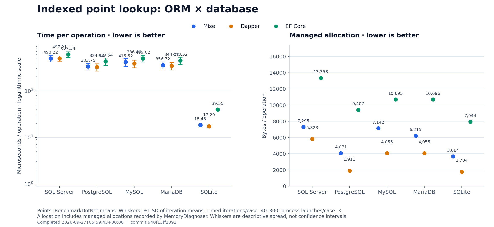
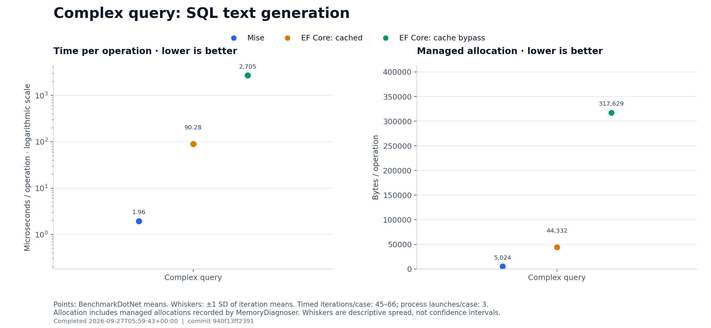
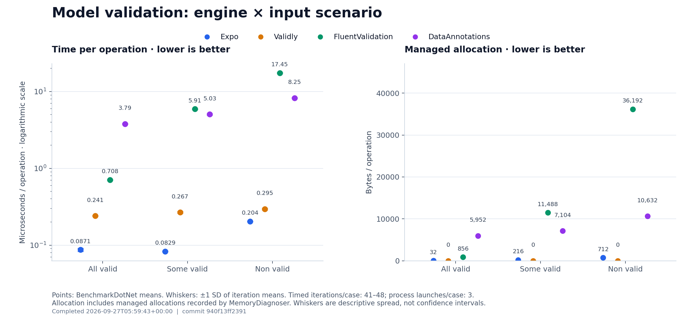
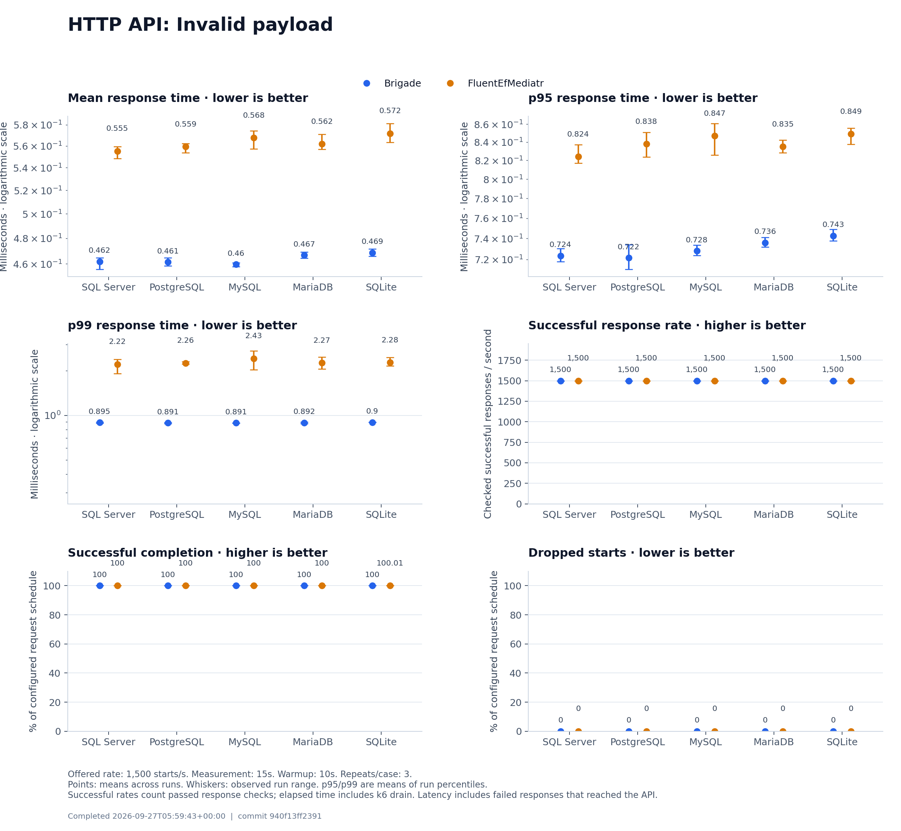
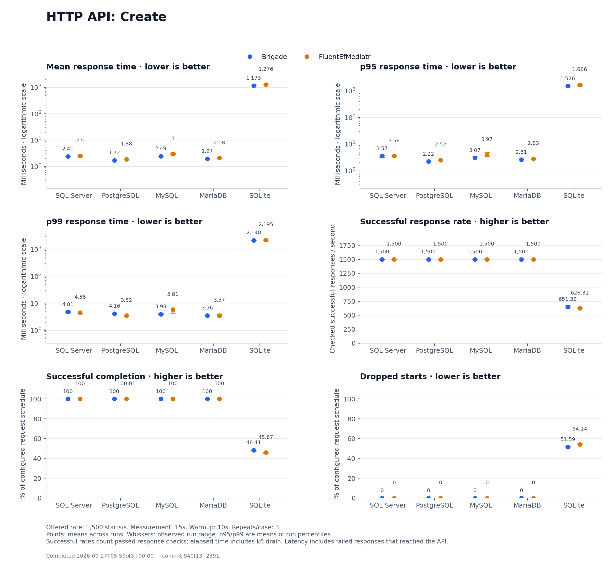
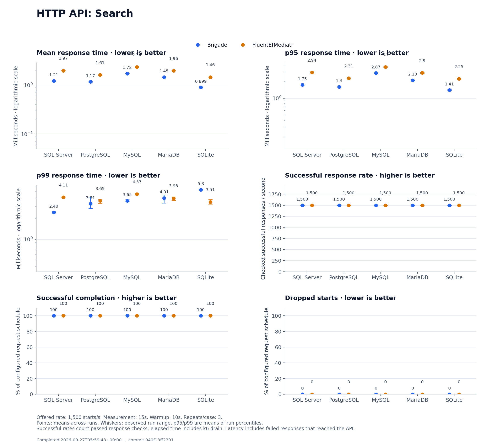
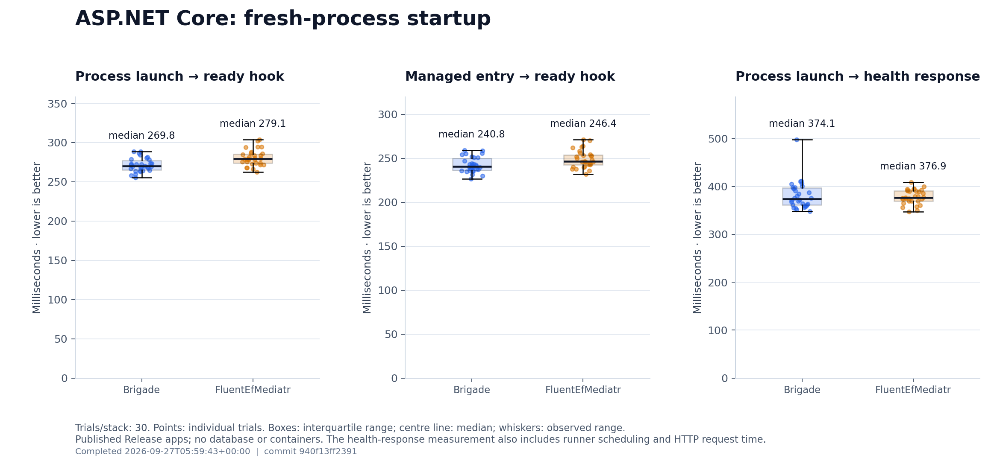

# Benchmark results

This report records measurements for database querying, SQL text generation, model validation, HTTP API load, and application startup. Each section defines the timed operation and the direction of its metrics.

## Running the benchmarks

Run these commands from the repository root on Linux.

### 1. Prerequisites

- .NET 10 SDK.
- Docker with a running daemon.
- k6 available on `PATH`, or its executable path set in `BENCH_K6`.
- Python 3.11 or newer, with virtual-environment support.

Create a Python environment and install the plotting library:

```bash
python3 -m venv Benchmarks/.work/venv
Benchmarks/.work/venv/bin/python -m pip install matplotlib==3.10.7
```

### 2. Calibrate the API request rate

```bash
Benchmarks/.work/venv/bin/python Benchmarks/Api/calibrate.py
```

The calibration script tests both stacks, all five databases, and the invalid, create, and search workloads. It starts each case at 1,000 RPS and increases by 200 RPS after each five-second measurement. A dropped start or failed response check stops that case. Later cases use the lowest passing ceiling found so far. After all 30 cases complete, the script prints a suggested rate 200 RPS below the shared ceiling and saves its measurements under `Benchmarks/.work/calibration/`.

### 3. Configure the API benchmark

Set the shared request rate for the full run:

```bash
export BENCH_RPS=1500
```

Use the rate selected from calibration for this machine. The API runner's default is 1,500 RPS; `BENCH_RPS` overrides that default for every database, stack, and workload. To persist a different default, update `Rate` in [BenchmarkOptions.cs](Api/Runner/Plan/BenchmarkOptions.cs).

### 4. Run the complete suite

```bash
Benchmarks/.work/venv/bin/python Benchmarks/run.py
```

The [script](run.py) runs the existing parity tests, builds the solution in Release mode, and executes every benchmark. After passing parity tests and collecting complete measurements, it replaces the graphs in `Benchmarks/Charts/` and generates `Benchmarks/README.md` from this template. Raw measurements, command logs, test results, and published binaries are saved under `Benchmarks/.work/`.

To regenerate the graphs and report from a saved complete run:

```bash
Benchmarks/.work/venv/bin/python Benchmarks/run.py --render-only <run-directory>
```

## Database querying



- Implementations: Mise, Dapper, and EF Core.
- Platforms: SQL Server, PostgreSQL, MySQL, MariaDB, and SQLite.
- Input: indexed point lookups against a deterministic 1,000-row account table. The parameter sequence cycles through account IDs.
- Timed operation: execute an asynchronous lookup and materialize the same account ID and name through the shared query implementations used by the parity tests.
- Setup: Aspire starts and seeds the databases before measurement. Each implementation uses an already-open connection. EF Core uses a normal cached LINQ query with tracking disabled. Mise constructs its query during each operation.
- Measurement: BenchmarkDotNet performs pilot, warmup, and measurement iterations, with 3 process launches per case against the same database server. The graph shows means and one standard deviation of iteration means.
- Metric direction: lower time per operation is better. Lower managed allocation per operation is better. These measurements describe single-client point lookups.

## Complex query to SQL text



- Input: equivalent preconstructed Mise and EF Core queries in the SQL Server dialect. The query includes joins, a correlated existence test, filtering, grouping, a group filter, sorting, and pagination.
- Timed operation: `QueryBuilder.Compile().Text` for Mise; `ToQueryString()` for EF Core.
- Cases: Mise rendering, EF Core with its normal cache, and EF Core with the compiled-query cache bypassed. EF Core's cached and bypassed cases use the same expression and produce identical SQL text.
- Measurement: BenchmarkDotNet performs warmup and measurements over 3 process launches per case. Whiskers show one standard deviation of iteration means. EF Core's public SQL-text API includes diagnostic formatting; the cache-bypass implementation uses an internal EF Core service.
- Metric direction: lower SQL-text generation time is better. Lower managed allocation per operation is better. The cache-bypass case measures repeated compilation in a warm process.

## Model validation



- Implementations: Expo, Validly, FluentValidation, and DataAnnotations.
- Input: equivalent 12-field validation contracts covering required strings, length bounds, email format, and numeric ranges.
- Scenarios: all valid, some valid with four failing fields, and non valid with all twelve fields failing.
- Timed operation: validate the model and count failed fields through the same shared validation functions used by the parity tests. Expo's error sequence is fully enumerated. Validly's pooled result is disposed during the operation.
- Setup: models and reusable validator instances are constructed before measurement.
- Measurement: BenchmarkDotNet controls warmup and iterations over 3 process launches per case. Whiskers show one standard deviation of iteration means.
- Metric direction: lower validation time is better. Lower managed allocation per operation is better. These workloads measure the specified rules and error enumeration.

## HTTP API load

The applications use Partie, Expo, and Mise for the Brigade stack, and MediatR, FluentValidation, and EF Core for FluentEfMediatr. Both register matching routes across the five database platforms. Aspire starts both apps and the selected database. k6 runs on the same machine as the apps and database containers.

- Requested rate: 1,500 starts per second for each database, stack, and workload.
- Measurement window: 15 seconds per run.
- Warmup: 10 seconds before each measured run.
- Repeats: 3 per case, with alternating stack order.
- Load model: constant arrival rate with 100 preallocated virtual users and a maximum of 1000.
- PostgreSQL connections: maximum pool size 49 per application; server limit 110, including capacity for benchmark setup and Aspire health checks.
- Reset: deterministic schema and seed data before warmup and again before measurement. Resets occur outside the timed windows.
- Memory gate: at least 4 GiB of system available memory before each k6 process.
- Criteria: p95 below 250 ms, p99 below 500 ms, HTTP failure rate below 0.1%, passed checks above 99.9%, and zero dropped starts. Criteria are evaluated over the full measurement window.
- Observed criteria status: 6 of 90 measured runs exceeded at least one configured criterion.

Graphs show means across runs. The p95 and p99 points are means of per-run percentiles. Whiskers show the observed range across runs.

Successful RPS counts response checks that passed, divided by elapsed k6 test time, including drain time. Successful completion divides passed checks by the configured request schedule, requested RPS multiplied by measurement duration. An expected rejection is a successful outcome in the invalid-payload workload. Dropped starts use the same configured schedule as their denominator. Schedule-boundary rounding can produce small departures from exactly 100%.

Lower response latency is better. Higher successful RPS and successful completion are better. Lower dropped-start percentage is better. Latency describes requests started by k6, including failed responses. Dropped starts can reflect occupied virtual users or load-generator scheduling limits. These measurements describe performance at the configured request rate.

### Invalid payload



The request fails the same field-validation rules in both applications. Each response check requires HTTP 400. The applications reject the request before database access.

### Create



The client sends deterministic, distinct titles with valid category IDs and scores. Each handler checks that the category exists, is active, and permits the requested score, then inserts the record. Each response check requires HTTP 200 and a positive database-generated ID. The table grows during each measured run.

### Search



The requests vary category and minimum-score parameters against the seeded dataset. The query orders by ID and returns at most twenty items. Each response check requires HTTP 200 and an array response.

## Application startup



- Applications: the two stacks each expose twelve CQRS endpoints, twelve mapped schema models, four fake connection configurations, four application configuration groups, and the same authentication and authorization policies.
- Execution: published Release output launched directly in a fresh process, with Production configuration.
- Trials: 30 per stack, with alternating launch order.
- Primary metric: elapsed time from immediately before process launch to the timestamp captured inside `ApplicationStarted`.
- Additional metrics: managed entry to `ApplicationStarted`, and process launch to the first successful health response. The health-response measurement includes runner scheduling and HTTP request time.
- Instrumentation: framework logging is disabled. Each app writes its entry and readiness timestamps. The runner calculates elapsed time from the captured monotonic timestamps.
- Graph: individual trials, median, interquartile range, and observed minimum-to-maximum range.
- Metric direction: lower startup time is better. This measures fresh processes on a running machine; filesystem caches can remain warm. Each stack retains its normal lazy initialization, including work deferred until a business endpoint or database operation runs.

## Measurement scope

The BenchmarkDotNet plots use iteration statistics; the HTTP API plots summarize repeated fixed-duration runs; the startup plot shows separate process launches. Their error bars and distributions describe these respective units of observation.

Measurements depend on the host, runtime, database configuration, and specified workload. Database comparisons include each platform's driver and engine behavior.

## Run metadata

- Started, UTC: 2026-09-27T04:20:05+00:00
- Completed, UTC: 2026-09-27T05:59:43+00:00
- Repository commit: `940f13ff23912013c0a15725a359cc803e294eb9`
- Working tree at launch: modified
- Source-content SHA-256: `84e4d1e045bb595c69fbd4403fbe18b83e7a10d04b31419097da1336fadc7f75`
- Parity gate: 3 test projects passed.
- Build configuration: Release.
- Operating system: Linux-7.1.3+deb13-amd64-x86_64-with-glibc2.41
- Architecture: x86_64
- CPU: Intel(R) Core(TM) i9-7960X CPU @ 2.80GHz
- Logical processors: 32
- Process CPU affinity: 32 available processors.
- Physical memory: 31.0 GiB.
- Container CPU quota and period, microseconds: `max 100000`
- Container memory limit, bytes: `max`
- .NET SDK: 10.0.400
- Docker engine: 29.8.0
- k6: brigade-k6 v2.3.0 (commit/e088784614, go1.27.1, linux/amd64)
- Python: 3.13.5
- Plotting library: Matplotlib 3.10.7

Installed .NET runtimes:

```text
Microsoft.AspNetCore.App 10.0.11 [/usr/share/dotnet/shared/Microsoft.AspNetCore.App]
Microsoft.NETCore.App 10.0.11 [/usr/share/dotnet/shared/Microsoft.NETCore.App]
```

Machine values describe the host visible to the runner. Linux cgroup limits are recorded when available; `max` denotes an unrestricted resource in that cgroup. The commit identifies the repository revision; the content digest identifies the measured source snapshot, including working-tree changes.
